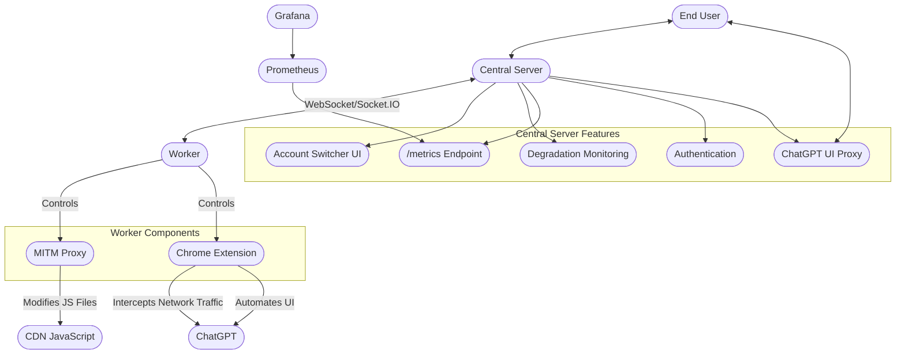

# Advanced ChatGPT Proxy - Architecture Documentation

## System Overview

This project implements a sophisticated proxy system for ChatGPT that enables sharing multiple ChatGPT accounts across users. The architecture consists of two main components: a central server and workers.

## System Components

### Central Server
- Handles end user connections and authentication
- Routes requests to available workers
- Proxies the ChatGPT UI to end users
- Manages account allocation and worker availability
- Streams responses back to end users
- Exposes `/metrics` endpoint for Prometheus monitoring of model usage and degradation data

### Workers
- Connect to the central server via WebSockets (Socket.IO)
- Maintain active ChatGPT sessions
- Execute tasks using browser automation
- Can run on separate machines from the central server
- Report status and availability to central server

### Chrome Extension
- Injects into ChatGPT web interface
- Connects to central server via WebSockets
- Executes commands from central server
- **Intercepts network traffic** by hooking JavaScript's fetch API
- Captures and forwards ChatGPT responses
- Reports status information back to central server

### MITM Proxy
- **Only modifies JavaScript files loaded from CDN**
- Does not intercept ChatGPT.com traffic (would trigger ja3 fingerprinting detection)
- Injects custom code into ChatGPT's frontend JavaScript
- Enables automation capabilities
- Avoids direct manipulation of ChatGPT API traffic

### Account Switcher
- Provides UI to monitor account degradation status
- Allows switching between different accounts
- Displays account health metrics
- Available at `/accountswitcher/v2`

## Data Flow

1. End user connects to central server
2. User initiates a chat request
3. Central server assigns the task to an available worker
4. Worker executes the task using Chrome and the extension
5. MITM proxy modifies JavaScript files (not direct API traffic)
6. Chrome extension intercepts network traffic via JS hooks
7. Worker simulates user interaction to bypass detection
8. Responses are streamed back to central server
9. Central server forwards responses to the end user

## System Diagram

## Technical Details

### Detection Avoidance
- MITM proxy **only** modifies JavaScript from CDNs, not direct ChatGPT traffic
- Avoids ja3 fingerprinting detection by not intercepting ChatGPT.com traffic
- Chrome extension intercepts network traffic by hooking the fetch API in JavaScript
- Simulates natural user interaction patterns to avoid behavioral detection

### Monitoring and Metrics
- Exports metrics data via `/metrics` endpoint
- Tracks model usage statistics
- Monitors account degradation status
- Integrates with Prometheus and Grafana for visualization

### Account Management
- Supports multiple ChatGPT accounts with different capabilities
- Detects and responds to account degradation
- Provides account switching capabilities via UI
- Distributes load across multiple accounts

### Communication
- Uses Socket.IO for real-time bidirectional communication
- Maintains persistent connections between components
- Supports streaming responses from workers to central server to end users

## Configuration

The system uses two main configuration files:

- `config.centralserver.js`: Central server settings including ports, authentication, and Socket.IO configuration
- `config.worker.js`: Worker settings including account credentials, Chrome paths, and central server connection details