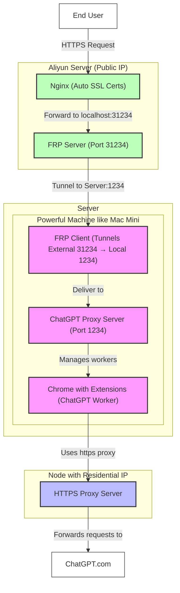

招有志之士一起投入本项目的研发，这是一个独特的变革性的技术，虽然难，但是很有意义。[./TODO.md](./TODO.md)
当中有许多可以做的事情。如果每个月可以投入20小时以上用于开发，我可提供家宽IP + Plus订阅。

Seeking dedicated individuals to join the research and development of this project. This is a unique and transformative
technology that, although challenging, is very meaningful. There are many tasks that can be undertaken in ./TODO.md. If
you can commit more than 20 hours per month to development, I can provide residential IP + Plus subscription.

---

# Advanced ChatGPT Proxy

An advanced proxy system for ChatGPT that uses browser automation to simulate user interactions and avoid triggering
mechanisms that detect the proxy and trigger degradation.

## Disclaimer

**IMPORTANT:** This project is an improved version of many existing ChatGPT proxies, intended to better support
legitimate use cases only. Please note:

- This tool is provided for educational and research purposes only
- Do NOT use this proxy for any illegal activities or to violate OpenAI's terms of service
- The author accepts no responsibility or liability for how this software is used
- This is a new project and likely contains bugs and security issues
- This tool is very hard to deploy, not noob-friendly, you should not attempt to deploy it unless you are a professional
- Use at your own risk - no warranty or support is provided

## Features

- **Multiple Proxy Modes**:
   - Direct reverse proxy for static resources and some unimportant API requests
   - Browser-based fetch for API requests
   - Full browser automation for generating content
- **Authentication System**: Secure token-based authentication with conversation access control
- **Conversation Management**: Track and control access to conversations
- **Worker System**: Efficient distribution of tasks to available browser instances
- **WebSocket Communication**: Real-time streaming of responses

## How It Works

The system operates through a combination of server-side proxy and browser automation:

1. Requests are handled through one of three proxy modes:
   - Direct reverse proxy (for static resources)
   - Browser JS fetch (for regular API calls)
   - Browser automation (for generation interfaces)

2. The browser automation simulates actual user interactions with ChatGPT, which helps avoid triggering any detection
   mechanisms that might mark your account and reduce response quality.

## Prerequisites

- macOS machine (e.g., Mac Mini)
- Node.js and npm
- Google Chrome browser

### Chrome Extension Setup

1. Open Chrome and navigate to `chrome://extensions/`
2. Enable "Developer mode"
3. Click "Load unpacked" and select the `chrome-extension` directory
4. The extension will automatically connect to your local server

## Deployment Steps

1. **Open Chrome with special flags**:

   * `"/Applications/Google Chrome.app/Contents/MacOS/Google Chrome" --autoplay-policy=no-user-gesture-required --disable-background-timer-throttling --disable-backgrounding-occluded-windows --disable-renderer-backgrounding --disable-ipc-flooding-protection`
   * The plugin will play sound periodically to prevent the browser from throttling generation.

2. **Configure Residential Proxy in Chrome:**

   * Set up your high-quality residential IP proxy server within the Google Chrome browser's proxy settings. This is
     the outbound proxy Chrome instances will initially use to connect to ChatGPT.

   * You need to use a high-quality proxy for ai with residential IP addresses.

   * Currently, only HTTPS connect proxy is supported, you can quickly deploy one using this
     tool: https://github.com/KevinWang15/http-proxy-autossl

3. **Set Up Visible Chrome Worker Windows:**

   * Use display management software (like BetterDisplay on macOS) to create one or more virtual displays.
   * Open multiple Chrome windows and arrange them (tile them) across these virtual displays.
   * **Crucially, ensure every Chrome window remains fully visible on a display.** Do not minimize, hide, or fully
     obscure them. Chrome significantly throttles or pauses background processes in non-visible windows, which will
     prevent or impede content generation by the workers.

4. **Prevent System Lock/Sleep:**
   * Configure your machine's power and screen saver settings to prevent it from ever locking the screen or going to
     sleep. A locked screen makes the Chrome windows non-visible, leading to the same generation issues mentioned
     above.

5. **Log in to ChatGPT and Obtain Cookies:**
   * In one of the prepared Chrome windows, navigate to `chatgpt.com` and log in to your account.
   * Obtain the cookies for ChatGPT.com after login.

6. **Retrieve Access Token:**
   * While still logged into ChatGPT in the same browser window, navigate directly to the URL:
     `https://chatgpt.com/api/auth/session`.
   * Obtain the access token from that page.

7. **Start the Proxy Server Application:**
   * Launch the main proxy application (e.g., by running `./index.js`).
   * You will need to provide the `ACCESS_TOKEN` (from step 5), the `COOKIE` (from step 4), and ensure the `PROXY`
     environment variable is correctly set to your residential IP proxy address (configured in step 1).

8. **Enable the Chrome Extension:**
   * Go to `chrome://extensions/` in your Chrome browser.
   * Ensure the custom ChatGPT proxy extension is enabled.

9. **Configure Local Proxy for Code Injection:**
   * Install the `rootCA.crt` and trust it as the root cert.
   * Change the proxy settings *within the Chrome browser(s)* being used as workers to point to the local MITM proxy:
     `127.0.0.1:1235`.
   * Open the Chrome Developer Tools (usually F12).
   * Go to the "Network" tab and check the "Disable cache" option.
   * With DevTools open and cache disabled, reload the ChatGPT page (`chatgpt.com`). This forces the browser to fetch
     all resources through the local proxy (`127.0.0.1:1235`), allowing it to inject the necessary code.

10. **Deployment Complete:**
   * The setup process is finished. The Advanced ChatGPT Proxy service should now be running and accessible on
     `127.0.0.1:1234`. Users can connect to this address to utilize the proxy.
   * If you will serve it under nginx reverse proxy and SSL, you can configure the `PUBLIC_HOST` env variable to
     `https://yourdomain.com`.

## Usage

1. Access the proxy through your configured URL
2. For new users, use the passcode at `/start?passcode=your_passcode`
3. The Chrome extension will register browser tabs as workers
4. Requests will be distributed to available workers
5. The status overlay in the corner of Chrome shows worker status

## Configuration Options

The system can be configured through the `config.js` file.

## Roadmap

The following features and fixes are planned:

* Fix bugs in edge cases
* Address Chrome slowdown issues when chrome is not visible or minimized
* Add missing features: read aloud, advanced voice mode, canvas, temporary chat
* Add worker count metrics & alerts

## Contributing

Contributions are welcome! Please feel free to submit a Pull Request with improvements or bug fixes.

## License

MIT