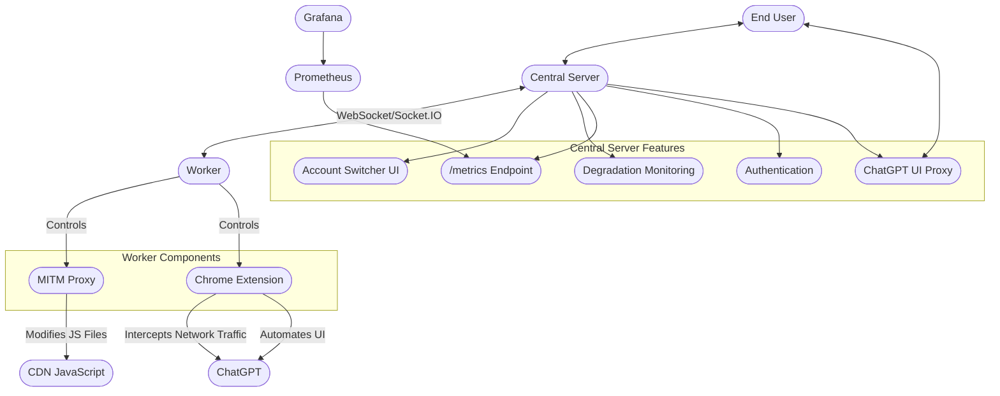

招有志之士一起投入本项目的研发，这是一个独特的变革性的技术，虽然难，但是很有意义。[./TODO.md](./TODO.md)
当中有许多可以做的事情。如果每个月可以投入20小时以上用于开发，我可提供家宽IP + Plus订阅。

Seeking dedicated individuals to join the research and development of this project. This is a unique and transformative
technology that, although challenging, is very meaningful. There are many tasks that can be undertaken in ./TODO.md. If
you can commit more than 20 hours per month to development, I can provide residential IP + Plus subscription.

---

# Advanced ChatGPT Proxy

An advanced proxy system for ChatGPT that uses browser automation to simulate user interactions and avoid triggering
mechanisms that detect the proxy and trigger degradation.

## Disclaimer

**IMPORTANT:** This project is an improved version of many existing ChatGPT proxies, intended to better support
legitimate use cases only. Please note:

- This tool is provided for educational and research purposes only
- Do NOT use this proxy for any illegal activities or to violate OpenAI's terms of service
- The author accepts no responsibility or liability for how this software is used
- This is a new project and likely contains bugs and security issues
- This tool is very hard to deploy, not noob-friendly, you should not attempt to deploy it unless you are a professional
- Use at your own risk - no warranty or support is provided

---

**Please review the codebase directly to understand how everything works. This project is not intended for beginners.**

---

# System Architecture

This project implements a sophisticated proxy system for ChatGPT that enables sharing multiple ChatGPT accounts across users. The system consists of two main components: a central server and workers.

## System Components

### Central Server
- Handles end user connections and authentication
- Routes requests to available workers
- Proxies the ChatGPT UI to end users
- Manages account allocation and worker availability
- Streams responses back to end users
- Exposes `/metrics` endpoint for Prometheus monitoring of model usage and degradation data

### Workers
- Connect to the central server via WebSockets (Socket.IO)
- Maintain active ChatGPT sessions
- Execute tasks using browser automation
- Can run on separate machines from the central server
- Report status and availability to central server

### Chrome Extension
- Injects into ChatGPT web interface
- Connects to central server via WebSockets
- **Intercepts network traffic** by hooking JavaScript's fetch API
- Captures and forwards ChatGPT responses
- Executes commands from central server (with the help of code injection from the MITM proxy)

### MITM Proxy
- **Only modifies JavaScript files loaded from CDN**
- Does not intercept ChatGPT.com traffic (would trigger ja3 fingerprinting detection)
- Injects custom code into ChatGPT's frontend JavaScript
- Enables automation capabilities

### Account Switcher
- Provides UI to monitor account degradation status
- Allows switching between different accounts
- Displays account health metrics
- Available at `/accountswitcher/v2`

## System Diagram

## Data Flow

1. End user connects to central server
2. User initiates a chat request
3. Central server assigns the task to an available worker
4. Worker executes the task using Chrome/AdsPower and the extension
5. MITM proxy modifies JavaScript files (not direct API traffic)
6. Chrome extension intercepts network traffic via JS hooks
7. Worker simulates user interaction to bypass detection
8. Responses are streamed back to central server
9. Central server forwards responses to the end user

# Installation and Deployment

## Prerequisites
- Browser options:
  - Regular Chrome/Chromium browser, OR
  - [AdsPower Browser](https://www.adspower.net/) (strongly recommended for multi-account setups)
- Node.js v16+
- mitmproxy installation
- ChatGPT accounts with valid cookies/tokens

## Central Server Setup
1. Clone the repository
2. Copy `config.centralserver.example.js` to `config.centralserver.js` and configure as needed
3. Install dependencies: `npm install`
4. Start the central server: `CONFIG=./config.centralserver.js node index.js`

## Worker Setup
1. Copy `config.worker.example.js` to `config.worker.js` and configure with account details
2. Choose your browser configuration in `config.worker.js`:
   - For regular Chrome: Configure the `chrome.bin` path
   - For AdsPower: Configure `adspower.baseUrl`, `adspower.apiKey`, and `adspower.groupId`
3. Start the worker: `CONFIG=./config.worker.js node index.js`
4. Workers can be run on the same machine or on different machines

## Monitoring Setup (Optional)
1. Navigate to the `monitoring` directory
2. Configure Prometheus targets in `prometheus/targets/chatgpt-targets.json`
3. Start monitoring stack: `docker-compose up -d`
4. Access Grafana on port 3000 to view dashboards

## Account Switcher Access
- Navigate to `http://<central-server-host>:<port>/accountswitcher/v2/`
- Monitor account degradation status and health metrics
- Switch between available accounts as needed

# Key Features

- **Multi-account support**: Share multiple ChatGPT accounts across users
- **Dual browser support**: Use either Chrome or AdsPower for different needs
- **Advanced browser fingerprinting protection**: Superior with AdsPower integration
- **Distributed architecture**: Workers can run on separate machines
- **Detection avoidance**: Does not intercept ChatGPT.com traffic directly
- **Real-time response streaming**: Maintains ChatGPT's streaming capabilities
- **Transparent proxy**: End users interact with a familiar ChatGPT interface
- **Automation with detection avoidance**: Simulates natural user interactions
- **Account rotation**: Distributes load across multiple accounts
- **Degradation monitoring**: Detect and respond to account quality issues
- **Metrics exposure**: `/metrics` endpoint for Prometheus integration

# Technical Details

## Detection Avoidance
- MITM proxy **only** modifies JavaScript from CDNs, not direct ChatGPT traffic
- Avoids ja3 fingerprinting detection by not intercepting ChatGPT.com traffic
- Chrome extension intercepts network traffic by hooking the fetch API in JavaScript
- Simulates natural user interaction patterns to avoid behavioral detection

## Monitoring and Metrics
- Exports metrics data via `/metrics` endpoint
- Tracks model usage statistics
- Monitors account degradation status
- Integrates with Prometheus and Grafana for visualization

## Account Management
- Supports multiple ChatGPT accounts with different capabilities
- Detects and responds to account degradation
- Provides account switching capabilities via UI
- Distributes load across multiple accounts

## Configuration Options

The system uses two main configuration files:

### config.centralserver.js
- Server port and host settings
- Authentication passcode

### config.worker.js
- Central server connection details
- Account credentials (cookies, tokens)
- Browser configuration:
  - Chrome/Chromium binary path, OR
  - AdsPower API settings (baseUrl, apiKey, groupId)
- Proxy settings for accounts

### Browser Configuration (AdsPower vs Chrome)

#### Using Regular Chrome
- Simple setup for single account testing
- Uses direct Chrome automation
- Limited fingerprint protection (okay if you only want to run a single account)
- Less overhead but more detection risk

#### Using AdsPower (Recommended)
- Superior for multi-account setups
- Automatic profile management with unique browser fingerprints
- Better detection avoidance with built-in anti-fingerprinting
- Isolates each account in its own browser instance
- Simplifies managing multiple accounts with different configurations
- Automatically creates and maintains browser profiles for each account

